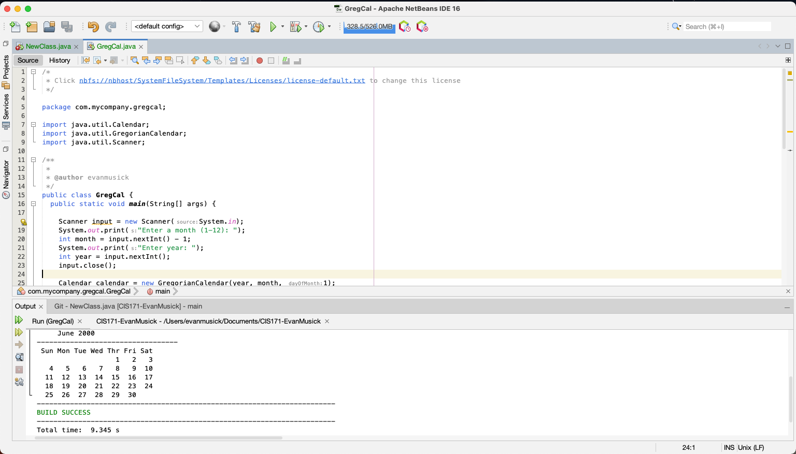

# Project Title

Gregorian Calendar

## Example Output

This image will display as your example output. Name the image README.jpg in your project folder.



## Analysis Steps
The analysis steps of the program were figuring out the problem that the program needed to solve. For this assignment, the problem was to create a calendar using the GregorianCalendar and Calendar Classes to create a program that would display whichever month calendar for the month/year the user enters.

### Design
To design this program I started by looking at the documentation linked in the resource video prodived by instructor.
I then utilized what I learned from scanning through that documentation to implement into my program.
Doing so, I first imported my calendar classes, created those objects, and added a scanner.
The scanner was to allow the user to input their desired month/year, rather than being hard coded.
The calendar then runs and outputs the correct month and year the user entered along with its corresponding month calendar.

### Testing

Tesing this was fun, not really. I had to code a few different versions of this assignment
to figure out how it was intended to be created. I had tested out trying to create a calendar program
without using the classes, and that confused me (obviously since it wasn't the direction of the assignment)
After I cleared this misunderstanding up, I started testing my new program with classes and resources from documentation.
Testing this involved commenting out a lot of lines to figure out which one was breaking
the program, as well as I tried out var data type for the first time to get it to run with a data type error just for test purposes.
 Say what the step will be

```
Give the example
```

And repeat

```
until finished
```

End with an example of getting some data out of the system or using it for a little demo

Enter a month (1-12): 5
Enter year: 2000

RESULT:

     May 2000
----------------------------------
 Sun Mon Tue Wed Thr Fri Sat
       1   2   3   4   5   6
   7   8   9  10  11  12  13
  14  15  16  17  18  19  20
  21  22  23  24  25  26  27
  28  29  30  31


## Notes


## Do not change content below this line
## Adapted from a README Built With

* [Dropwizard](http://www.dropwizard.io/1.0.2/docs/) - The web framework used
* [Maven](https://maven.apache.org/) - Dependency Management
* [ROME](https://rometools.github.io/rome/) - Used to generate RSS Feeds

## Contributing

Please read [CONTRIBUTING.md](https://gist.github.com/PurpleBooth/b24679402957c63ec426) for details on our code of conduct, and the process for submitting pull requests to us.

## Versioning

We use [SemVer](http://semver.org/) for versioning. For the versions available, see the [tags on this repository](https://github.com/your/project/tags).

## Authors

* **Billie Thompson** - *Initial work* - [PurpleBooth](https://github.com/PurpleBooth)

See also the list of [contributors](https://github.com/your/project/contributors) who participated in this project.

## License

This project is licensed under the MIT License - see the [LICENSE.md](LICENSE.md) file for details

## Acknowledgments

* Hat tip to anyone who's code was used
* Inspiration
* etc
