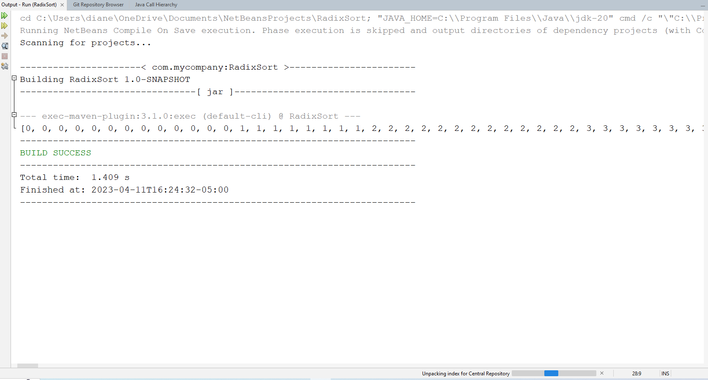

# Radix Sort
This Java program generates 1,000,000 random integers with a maximum value of 100,000, sorts them using radix sort, and prints the sorted array.

## Example Output

## Analysis Steps
1. Understand the requirements: Generate 1,000,000 random integers and sort them using radix sort.
2. Break down the problem into smaller tasks: Generate random integers, implement radix sort, and print the sorted array.
3. Plan the implementation of each task.

### Design
A single class RadixSort was used to keep the program simple and focused on the main task. This class includes methods for generating random integers, finding the maximum value, implementing radix sort, and implementing counting sort (as a helper method for radix sort).

public class RadixSort {
    ...
}

### Testing
1. Test the generation of random integers.
int[] randomIntegers = generateRandomIntegers(10, 100);
System.out.println(Arrays.toString(randomIntegers));

2. Test the getMax function with a small array.
int[] array = {5, 10, 15, 1, 9};
int max = getMax(array);
System.out.println("Max value: " + max);

3. Test the countSort function with a small array and a specific digit.
int[] array = {170, 45, 75, 90, 802, 24, 2, 66};
countSort(array, array.length, 1);
System.out.println(Arrays.toString(array));

4. Test the full radixSort function with a small array.
int[] array = {170, 45, 75, 90, 802, 24, 2, 66};
radixSort(array);
System.out.println(Arrays.toString(array));

5. Test the complete program with 1,000,000 integers.
int[] array = generateRandomIntegers(ARRAY_SIZE, MAX_VALUE);
radixSort(array);
System.out.println(Arrays.toString(array));

## Notes
No known issues. To test the program, simply run the main method, and the program will generate, sort, and print the array of 1,000,000 integers.

## Do not change content below this line
## Adapted from a README Built With

* [Dropwizard](http://www.dropwizard.io/1.0.2/docs/) - The web framework used
* [Maven](https://maven.apache.org/) - Dependency Management
* [ROME](https://rometools.github.io/rome/) - Used to generate RSS Feeds

## Contributing

Please read [CONTRIBUTING.md](https://gist.github.com/PurpleBooth/b24679402957c63ec426) for details on our code of conduct, and the process for submitting pull requests to us.

## Versioning

We use [SemVer](http://semver.org/) for versioning. For the versions available, see the [tags on this repository](https://github.com/your/project/tags). 

## Authors

* **Billie Thompson** - *Initial work* - [PurpleBooth](https://github.com/PurpleBooth)

See also the list of [contributors](https://github.com/your/project/contributors) who participated in this project.

## License

This project is licensed under the MIT License - see the [LICENSE.md](LICENSE.md) file for details

## Acknowledgments

* Hat tip to anyone who's code was used
* Inspiration
* etc
