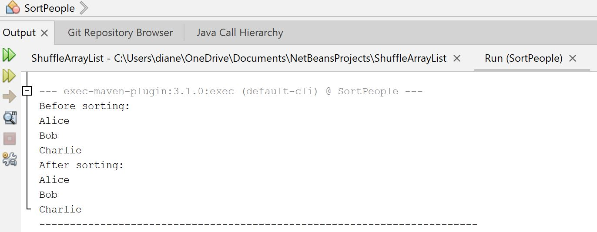

# Project Title
Sort People

## Description
This program demonstrates how to sort an ArrayList of Person objects using a static sort method. The Person class has four fields (name, address, phone number, and email address), a constructor, getter methods, and a static method to load test data. The sort method takes an ArrayList of any type that implements Comparable, and uses a selection sort algorithm to sort the elements in ascending order. The main method creates an ArrayList of Person objects, prints it before and after sorting, and shows the names of the people in alphabetical order.

## Example Output

## Analysis Steps
The requirements for the program were to create a Person class with four fields and a static method to load test data, and to create a static sort method that sorts an ArrayList of any type that implements Comparable. I designed the program to use a nested Person class that implements the Comparable interface to allow sorting by name. The sort method uses a selection sort algorithm to sort the ArrayList in ascending order.

## Design
I designed the program with a nested Person class that has four fields (name, address, phone number, and email address), a constructor, getter methods, and a static method to load test data. The Person class implements the Comparable interface to allow sorting by name. The sort method takes an ArrayList of any type that implements Comparable, and uses a selection sort algorithm to sort the elements in ascending order.

### Testing
I tested the program by creating an ArrayList of Person objects, printing it before and after sorting, and showing the names of the people in alphabetical order.

## Do not change content below this line
## Adapted from a README Built With

* [Dropwizard](http://www.dropwizard.io/1.0.2/docs/) - The web framework used
* [Maven](https://maven.apache.org/) - Dependency Management
* [ROME](https://rometools.github.io/rome/) - Used to generate RSS Feeds

## Contributing

Please read [CONTRIBUTING.md](https://gist.github.com/PurpleBooth/b24679402957c63ec426) for details on our code of conduct, and the process for submitting pull requests to us.

## Versioning

We use [SemVer](http://semver.org/) for versioning. For the versions available, see the [tags on this repository](https://github.com/your/project/tags). 

## Authors

* **Billie Thompson** - *Initial work* - [PurpleBooth](https://github.com/PurpleBooth)

See also the list of [contributors](https://github.com/your/project/contributors) who participated in this project.

## License

This project is licensed under the MIT License - see the [LICENSE.md](LICENSE.md) file for details

## Acknowledgments

* Hat tip to anyone who's code was used
* Inspiration
* etc
